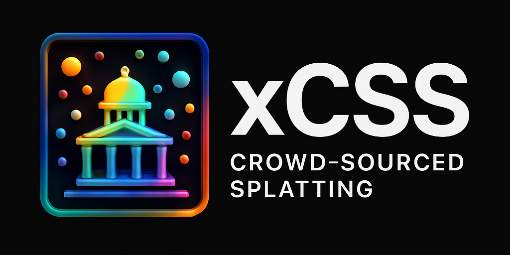

# xCSS: Extendable Crowd-Sourced Splatting

**Official implementation of _Extendable Crowd-Sourced Splatting_ (xCSS), an extension to [CSS (ICASSP 2025)](https://ieeexplore.ieee.org/document/10889766), combining MASt3R’s pose-free matching with NeRFStudio-based Gaussian Splatting.**

- 📘 [CSS Paper (ICASSP 2025)](https://ieeexplore.ieee.org/document/10889766)
- 📘 [MASt3R arXiv (2024)](https://arxiv.org/abs/2406.09756)
- 📘 [DUSt3R arXiv (2023)](https://arxiv.org/abs/2312.14132)

---

## Overview

xCSS bridges geometry-grounded image matching with 3D Gaussian Splatting to support scene reconstruction using crowd-sourced imagery **without requiring known camera poses**. By leveraging the MASt3R model for 2D-3D grounding and integrating it with `msplat` and `nerfstudio`, this pipeline enables scalable and flexible reconstruction of complex real-world environments.

---

## Table of Contents

- [xCSS: Extendable Crowd-Sourced Splatting](#xcss-extendable-crowd-sourced-splatting)
  - [Overview](#overview)
  - [Table of Contents](#table-of-contents)
  - [Installation](#installation)
    - [Step 1: Install MASt3R](#step-1-install-mast3r)
      - [1. Clone the repository](#1-clone-the-repository)
      - [2. Setup environment with conda](#2-setup-environment-with-conda)
      - [3. Compile and install ASMK (retrieval support)](#3-compile-and-install-asmk-retrieval-support)
      - [4. Compile CUDA kernels for RoPE embeddings](#4-compile-cuda-kernels-for-rope-embeddings)
      - [5. Download pre-trained MASt3R models](#5-download-pre-trained-mast3r-models)
    - [Step 2: Install NeRFStudio](#step-2-install-nerfstudio)
    - [Step 3: Install msplat](#step-3-install-msplat)
    - [Step 4: Run xCSS](#step-4-run-xcss)
  - [Citation](#citation)
  - [License](#license)

---

## Installation

### Step 1: Install MASt3R

<details>
<summary>Expand full instructions for MASt3R installation</summary>

#### 1. Clone the repository

```bash
git clone --recursive https://github.com/naver/mast3r
cd mast3r
````

#### 2. Setup environment with conda

```bash
conda create -n mast3r python=3.11 cmake=3.14.0
conda activate mast3r
conda install pytorch torchvision pytorch-cuda=12.1 -c pytorch -c nvidia
pip install -r requirements.txt
pip install -r dust3r/requirements.txt
pip install -r dust3r/requirements_optional.txt  # for HEIC image and visual localization support
```

#### 3. Compile and install ASMK (retrieval support)

```bash
pip install cython
git clone https://github.com/jenicek/asmk
cd asmk/cython/
cythonize *.pyx
cd ..
pip install .
```

#### 4. Compile CUDA kernels for RoPE embeddings

```bash
cd dust3r/croco/models/curope/
python setup.py build_ext --inplace
cd ../../../../
```

#### 5. Download pre-trained MASt3R models

```bash
mkdir -p checkpoints/
wget https://download.europe.naverlabs.com/ComputerVision/MASt3R/MASt3R_ViTLarge_BaseDecoder_512_catmlpdpt_metric.pth -P checkpoints/
wget https://download.europe.naverlabs.com/ComputerVision/MASt3R/MASt3R_ViTLarge_BaseDecoder_512_catmlpdpt_metric_retrieval_trainingfree.pth -P checkpoints/
wget https://download.europe.naverlabs.com/ComputerVision/MASt3R/MASt3R_ViTLarge_BaseDecoder_512_catmlpdpt_metric_retrieval_codebook.pkl -P checkpoints/
```

</details>

---

### Step 2: Install NeRFStudio

Follow the official NeRFStudio installation guide here:
📘 [https://docs.nerf.studio/quickstart/installation.html](https://docs.nerf.studio/quickstart/installation.html)

Ensure it is installed correctly by running:

```bash
ns-train --help
```

---

### Step 3: Install msplat

We use [`msplat`](https://github.com/pointrix-project/msplat) for the Gaussian Splatting backend:

```bash
pip install git+https://github.com/pointrix-project/msplat.git
```

---

### Step 4: Run xCSS

Once MASt3R, NeRFStudio, and msplat are installed, run the main pipeline using:

```bash
bash xcss.sh [-d] [-s SCENE_GRAPH] <root_dir>
```

Make sure to place your input images in the directory referenced in the `xcss.sh` script.

This script will:

* Run MASt3R to detect dense matches and compute view correspondence
* Estimate scene structure from unposed images
* Launch NeRFStudio with msplat for pose-free 3D Gaussian Splatting

---

## Citation

If you use this project in your research, please cite both CSS and MASt3R:

```bibtex
@INPROCEEDINGS{10889766,
  author={Chen, Runze and Xiao, Mingyu and Luo, Haiyong and Zhao, Fang and Wu, Fan and Xiong, Hao and Liu, Qi and Song, Meng},
  booktitle={ICASSP 2025 - 2025 IEEE International Conference on Acoustics, Speech and Signal Processing (ICASSP)}, 
  title={CSS: Overcoming Pose and Scene Challenges in Crowd-Sourced 3D Gaussian Splatting}, 
  year={2025},
  pages={1-5},
  doi={10.1109/ICASSP49660.2025.10889766}
}

@misc{mast3r_arxiv24,
  title={Grounding Image Matching in 3D with MASt3R}, 
  author={Vincent Leroy and Yohann Cabon and Jerome Revaud},
  year={2024},
  eprint={2406.09756},
  archivePrefix={arXiv},
  primaryClass={cs.CV}
}
```

---

## License

This project is released under multiple licenses:

* **MASt3R**: CC BY-NC-SA 4.0 (non-commercial use)
* **msplat** and **NeRFStudio**: See their respective repositories
* Please also respect dataset licenses (e.g., MapFree is highly restricted)

